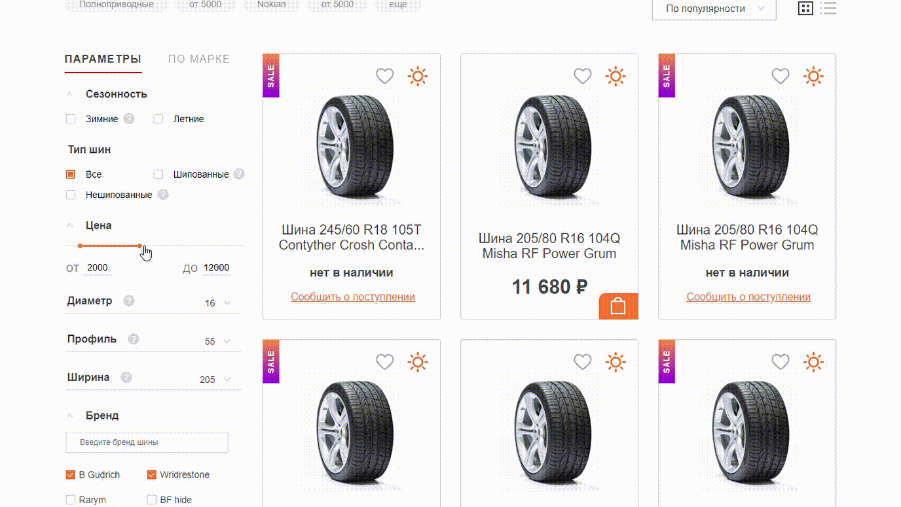
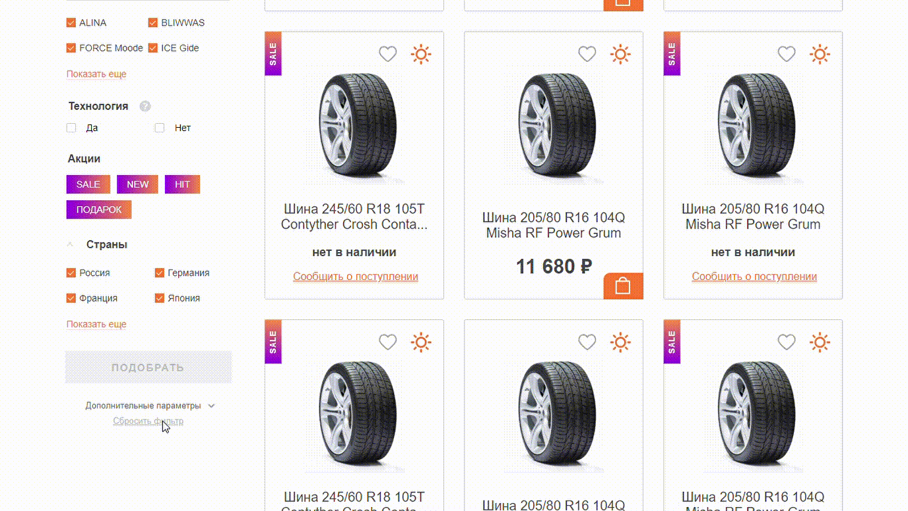
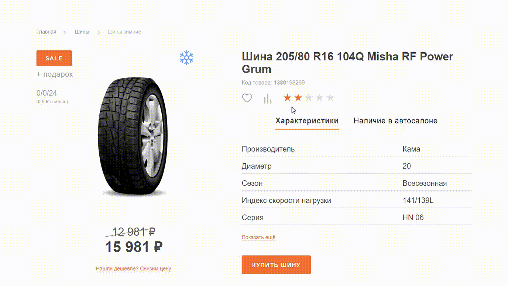

<h1 align="center">Spares Shop - online auto parts store</h1>

  
  
  

<h2>How to use</h2>

`npm i` - installation of project dependencies.

`npm test` - launch editor config and styleline.

`npm start` - build a project in development mode with a local server.

`npm run build` - build the project in production mode.

`npm run deploy` - build the project in production mode and send to GitHub Pages.

<h2>Description</h2>

On the store's pages there is site navigation, which is hidden in the drop-down menu and footer turning into accordion on the mobile version and tablet version.

There are four product carousels on the main page. I was interested in creating a carousel of promo products and discounted goods in various ways using native JavaScript.
The carousel of promo products has dots, endless scrolling and animation when switching slides. Arrows appear depending on the screen resolution.

The carousel of discounted goods has dots, a limited number of slides and arrows. The arrows have the disabled state when they are on the last slide.

The carousel of additional products is implemented using the slick-slider JavaScript library jquery. The carousel is adaptive, endless and supports touch control.
Arrows appear on the desktop width.

The search for products by parameter is implemented thanks to the tab script. The tab script is reused in many parts of the sites: in carousels of additional products and in product information on the product page.

The product filter is of particular interest on the catalog page. There are a lot of non-standard input fields here. It took a lot of time to create a non-standard range input with two runners. Thanks google search :)

The filter has a script to reset all entered values. The product card is reused on all pages and has an animation of adding to favorites.

The product page has complex grid rearrangements and previously created tabs script and slick slider. A rating scale is implemented on the page using CSS and a small JavaScript script.

<h2>About the project:</h2>

While working on this project, I tried to use previously acquired knowledge and reach a new level. I still used the mobile-first approach and the BEM methodology, but tried a different style of writing code.

In this project, I made the adaptive grids rubber. I tried out the new sass preprocessor. I tried to build a project using Gulp from scratch. I did the assembly in the syntax of modules, tried different packages, learned a lot of new things. It was an interesting experience.

I used the Figma graphic editor in my work, it is simple and extremely convenient. I tried to work on performance using Chrome DevTools.

The project has passed the W3C code validation checks and has good scores in Google Chrome Lighthouse.

<h2>Technologies and tools:</h2>
<ul>
<li>HTML</li>
<li>BEM</li>
<li>Sass</li>
<li>Gulp</li>
<li>Figma</li>
<li>NodeJs + npm</li>
<li>Native JavaScript</li>
<li>Jquery</li>
<li>Chrome DevTools</li>
</ul>

